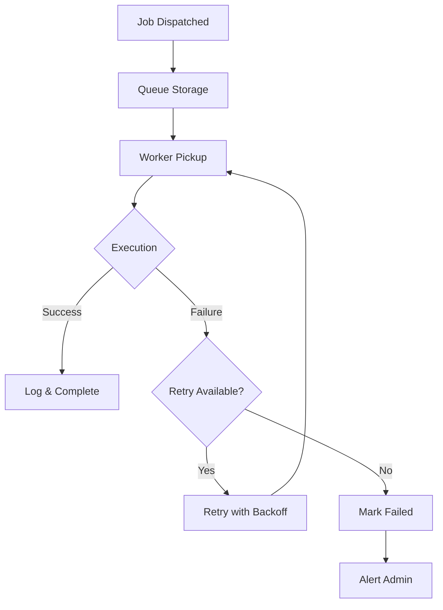

# Product Requirements Document (PRD) - Job Module

**Module**: Job
**Version**: 1.0
**Status**: Draft
**Last Updated**: 2026-03-12
**Author**: Product Team

---

## Document Control

| Version | Date | Author | Changes |
|---------|------|--------|---------|
| 1.0 | 2026-03-12 | Product Team | Initial draft |

---

## 1. Executive Summary

### 1.1 Problem Statement
> Modern applications require robust background job processing for async tasks, scheduled operations, and queue management. Without a centralized job management system, background processing becomes fragmented, monitoring is difficult, and failures go undetected. The platform needs a comprehensive job orchestration module to manage queues, schedule recurring tasks, monitor job health, and ensure reliable async processing.

### 1.2 Proposed Solution
> The Job module provides comprehensive queue and job scheduling infrastructure including job orchestration, queue management, scheduled task automation, job monitoring, retry logic, failure handling, and performance analytics. It leverages Laravel's queue system with enhanced tooling for operations teams to monitor, manage, and troubleshoot background jobs across the platform.

### 1.3 Business Value Proposition
- **Primary Value**: Reliable background processing with full observability
- **Secondary Value**: Operational efficiency through automation and monitoring
- **Strategic Alignment**: Platform reliability, scalability, operational excellence

### 1.4 Success Metrics (High-Level)
| Metric | Current | Target | Timeline |
|--------|---------|--------|----------|
| Job Success Rate | N/A | 99.5%+ | Q2 2026 |
| Queue Processing Time | N/A | <1 minute | Q2 2026 |
| Failed Job Resolution | N/A | <4 hours | Q2 2026 |
| Schedule Compliance | N/A | 100% | Q2 2026 |

---

## 2. Goals & Objectives

### 2.1 Primary Goals (SMART)
1. **Specific**: Build comprehensive job monitoring and management system for all background tasks
2. **Measurable**: Achieve 99.5%+ job success rate, <4 hour failed job resolution
3. **Achievable**: Leverage Laravel Horizon, Redis queues, and existing infrastructure
4. **Relevant**: Critical for platform reliability and async operations
5. **Time-bound**: Core job system by Q2 2026, advanced features by Q3 2026

### 2.2 Secondary Goals
- Implement job analytics and insights
- Build predictive scaling based on queue depth
- Create job dependency management
- Develop advanced retry strategies

### 2.3 Non-Goals
> What this module will NOT do (scope boundaries)
- Replace Laravel's queue system (enhance it)
- Real-time processing (use broadcasting/WebSockets)
- Distributed computing (specialized systems)

### 2.4 Key Results (OKRs)
| Objective | Key Result | Target | Status |
|-----------|------------|--------|--------|
| Reliability Excellence | Job success rate | 99.5%+ | Pending |
| Operational Efficiency | Failed job resolution | <4 hours | Pending |
| Queue Performance | Processing time | <1 minute | Pending |
| Automation | Scheduled tasks | 100% compliance | Pending |

---

## 3. Target Users

### 3.1 User Personas

#### Persona 1: System Administrator
| Attribute | Details |
|-----------|---------|
| Role | DevOps/System Admin |
| Goals | Monitor job health, resolve failures quickly |
| Pain Points | Invisible failures, manual monitoring, slow resolution |
| Technical Level | Advanced |
| Usage Frequency | Daily |

**User Story**:
> As a System Administrator, I want real-time visibility into job queues and failures, so that I can maintain platform reliability and quickly resolve issues.

#### Persona 2: Application Developer
| Attribute | Details |
|-----------|---------|
| Role | Backend Developer |
| Goals | Create and queue background jobs easily |
| Pain Points | Complex queue configuration, debugging difficulties |
| Technical Level | Advanced |
| Usage Frequency | Daily |

**User Story**:
> As an Application Developer, I want a simple job API with automatic retry and monitoring, so that I can offload async tasks without operational overhead.

#### Persona 3: Product Manager
| Attribute | Details |
|-----------|---------|
| Role | Product Owner |
| Goals | Ensure scheduled tasks run reliably |
| Pain Points | Missed schedules, data delays |
| Technical Level | Intermediate |
| Usage Frequency | Weekly |

**User Story**:
> As a Product Manager, I want to verify that scheduled jobs (reports, notifications) run on time, so that users receive timely updates.

### 3.2 Use Cases
| ID | Use Case | Actor | Trigger | Outcome |
|----|----------|-------|---------|---------|
| UC-001 | Queue background job | Developer | Async task needed | Job queued |
| UC-002 | Monitor queue health | Admin | Daily operations | Queue status |
| UC-003 | Retry failed job | Admin | Failure detected | Job retried |
| UC-004 | Schedule recurring task | Admin | Automation needed | Schedule created |
| UC-005 | Scale workers | System | High queue depth | Workers scaled |
| UC-006 | Generate job report | Admin | Performance review | Report generated |

### 3.3 Pain Points Addressed
| Pain Point | Severity | How Solved |
|------------|----------|------------|
| Invisible failures | High | Comprehensive monitoring |
| Manual retry processes | High | Automated retry with backoff |
| Queue backlogs | Medium | Auto-scaling workers |
| Schedule misses | Medium | Schedule monitoring, alerts |
| Debugging difficulty | Medium | Job logging, tracing |

---

## 4. Functional Requirements

### 4.1 Requirements Matrix

| ID | Requirement | Description | Priority | Acceptance Criteria |
|----|-------------|-------------|----------|---------------------|
| FR-001 | Job Queueing | Queue jobs for async processing | P0 | Laravel queue integration |
| FR-002 | Job Monitoring | Real-time queue and job monitoring | P0 | Dashboard with metrics |
| FR-003 | Failed Job Handling | Automatic retry, failure tracking | P0 | Retry with backoff |
| FR-004 | Job Scheduling | Schedule recurring jobs | P0 | Cron-like scheduling |
| FR-005 | Queue Management | Manage queue priorities, workers | P1 | Queue controls |
| FR-006 | Job Logging | Comprehensive job execution logs | P1 | Structured logging |
| FR-007 | Alerts & Notifications | Alert on failures, backlogs | P1 | Configurable alerts |
| FR-008 | Job Analytics | Performance metrics, trends | P2 | Analytics dashboard |
| FR-009 | Worker Scaling | Auto-scale workers based on load | P2 | Auto-scaling |
| FR-010 | Job Dependencies | Chain jobs, dependencies | P3 | Job chains |
| FR-011 | Rate Limiting | Limit job execution rate | P2 | Rate controls |
| FR-012 | Job Prioritization | Priority queue management | P1 | Priority levels |

### 4.2 Priority Definitions
- **P0 (Critical)**: Must have for launch - queueing, monitoring, scheduling
- **P1 (High)**: Should have - logging, alerts, prioritization
- **P2 (Medium)**: Nice to have - analytics, scaling, rate limiting
- **P3 (Low)**: Future consideration - dependencies, advanced features

### 4.3 Feature Details

#### Feature 1: Job Queueing System
**Description**: Robust job queueing with support for multiple queues, priorities, and batch processing.

**User Flow**:
```
1. Application dispatches job to queue
2. Job serialized and stored in Redis
3. Worker picks up job from queue
4. Job executed with timeout protection
5. Result logged, job marked complete
6. On failure, retry logic triggered
```

**Acceptance Criteria**:
- [ ] Support for Redis queue driver
- [ ] Multiple queue channels (default, high, low)
- [ ] Job priority within queues
- [ ] Batch job dispatching
- [ ] Job timeout configuration
- [ ] Job timeout protection

**Dependencies**: Redis, Laravel Queues

#### Feature 2: Job Monitoring Dashboard
**Description**: Real-time dashboard showing queue health, job metrics, and failure tracking.

**Acceptance Criteria**:
- [ ] Queue depth visualization
- [ ] Job throughput metrics
- [ ] Failed job list with details
- [ ] Worker status display
- [ ] Processing time metrics
- [ ] Real-time updates

**Dependencies**: Laravel Horizon, Redis

#### Feature 3: Scheduled Job Management
**Description**: Schedule and manage recurring jobs with cron-like syntax and monitoring.

**Acceptance Criteria**:
- [ ] Cron expression scheduling
- [ ] Human-readable schedule display
- [ ] Schedule overlap prevention
- [ ] Missed schedule detection
- [ ] Schedule history tracking
- [ ] Manual schedule trigger

**Dependencies**: Laravel Scheduler

---

## 5. Non-Functional Requirements

### 5.1 Performance Requirements
| Metric | Requirement | Measurement |
|--------|-------------|-------------|
| Job Queue Latency | <100ms | Queue to worker pickup |
| Queue Throughput | 1000 jobs/min | Sustained processing |
| Monitoring Refresh | <5s | Dashboard update |
| Failed Job Detection | <1 minute | Failure to alert |
| Availability | 99.9% | Queue system uptime |

### 5.2 Security Requirements
- [x] Authentication for admin dashboard
- [x] Authorization for job management
- [x] Job payload validation
- [x] Sensitive data encryption
- [x] Audit logging for job operations

### 5.3 Scalability Requirements
- Support for 10,000+ jobs/hour
- Horizontal worker scaling
- Queue partitioning
- Redis cluster support

### 5.4 Compliance Requirements
- [x] Data retention policies
- [x] Audit trail for job execution
- [x] GDPR compliance (job data)

---

## 6. User Experience

### 6.1 User Flows


### 6.2 Wireframes
> [Links to Figma/Sketch wireframes - to be created]

### 6.3 Design Principles
- Clear visual status indicators
- Actionable failure information
- Efficient failure resolution workflow
- Mobile-responsive monitoring

### 6.4 Interaction Specifications
| Interaction | Behavior | Feedback |
|-------------|----------|----------|
| View Failed Job | Click job | Detail panel |
| Retry Job | Click retry | Status update |
| Scale Workers | Adjust slider | Worker count update |
| Configure Alert | Form submit | Confirmation |

---

## 7. Technical Considerations

### 7.1 Architecture Overview
```
┌─────────────────────────────────────────────────────────┐
│                    Job Module                           │
│  ┌──────────────┐  ┌──────────────┐  ┌──────────────┐  │
│  │ Queue        │  │ Monitoring   │  │ Scheduling   │  │
│  │ Management   │  │ Dashboard    │  │ System       │  │
│  └──────────────┘  └──────────────┘  └──────────────┘  │
│  ┌──────────────┐  ┌──────────────┐  ┌──────────────┐  │
│  │ Failed Job   │  │ Worker       │  │ Alert        │  │
│  │ Handler      │  │ Management   │  │ System       │  │
│  └──────────────┘  └──────────────┘  └──────────────┘  │
└─────────────────────────────────────────────────────────┘
              │              │              │
              ▼              ▼              ▼
    ┌─────────────┐ ┌─────────────┐ ┌─────────────┐
    │    Redis    │ │   Horizon   │ │   Notify    │
    │   Queues    │ │   (UI)      │ │   Module    │
    └─────────────┘ └─────────────┘ └─────────────┘
```

### 7.2 Dependencies
| Dependency | Type | Version | Criticality |
|------------|------|---------|-------------|
| Laravel | Framework | 12.x | Critical |
| Laravel Horizon | Package | 5.x | Critical |
| Redis | Queue Backend | 7.x | Critical |
| Filament | UI Framework | 5.x | High |

### 7.3 Integration Points
| System | Integration Type | Data Flow | Frequency |
|--------|------------------|-----------|-----------|
| All Modules | Job Dispatch | Inbound | Per async task |
| Redis | Queue Storage | Bidirectional | Continuous |
| Notify Module | Alerts | Outbound | On events |
| Activity Module | Audit Trail | Outbound | Per operation |

### 7.4 Technical Constraints
- PHP 8.3+ required
- Laravel 12+ required
- Redis 6.0+ required
- Laravel Horizon compatibility

### 7.5 Database Schema
```sql
CREATE TABLE jobs (
    id BIGINT UNSIGNED AUTO_INCREMENT PRIMARY KEY,
    queue VARCHAR(100),
    payload LONGTEXT,
    available_at INT,
    created_at INT,
    reserved_at INT,
    
    INDEX idx_queue (queue),
    INDEX idx_available_at (available_at)
);

CREATE TABLE failed_jobs (
    id BIGINT UNSIGNED AUTO_INCREMENT PRIMARY KEY,
    uuid VARCHAR(255) UNIQUE,
    connection TEXT,
    queue TEXT,
    payload LONGTEXT,
    exception LONGTEXT,
    failed_at TIMESTAMP DEFAULT CURRENT_TIMESTAMP,
    
    INDEX idx_uuid (uuid)
);

CREATE TABLE job_batches (
    id VARCHAR(255) PRIMARY KEY,
    name VARCHAR(255),
    total_jobs INT,
    pending_jobs INT,
    failed_jobs INT,
    failed_job_ids LONGTEXT,
    options JSON,
    cancelled_at INT,
    created_at INT,
    finished_at INT
);
```

---

## 8. Analytics & Metrics

### 8.1 Success Metrics (KPIs)
| KPI | Definition | Target | Measurement Method |
|-----|------------|--------|-------------------|
| Job Success Rate | % successful jobs | 99.5%+ | Job tracking |
| Queue Processing Time | Avg time in queue | <1 minute | Timestamps |
| Failed Job Resolution | Time to resolve | <4 hours | Failure tracking |
| Schedule Compliance | % on-time execution | 100% | Schedule tracking |

### 8.2 Tracking Requirements
- Job throughput over time
- Failure rates by job type
- Queue depth trends
- Worker utilization
- Schedule adherence

### 8.3 Reporting Dashboards
- Queue health overview
- Job performance metrics
- Failure analysis
- Schedule compliance

---

## 9. Timeline & Milestones

### 9.1 Key Dates
| Milestone | Date | Status |
|-----------|------|--------|
| Requirements Complete | 2026-03-12 | Complete |
| Design Complete | 2026-03-26 | Pending |
| Development Start | 2026-03-27 | Pending |
| Core Features (P0) | 2026-04-17 | Pending |
| Beta Launch | 2026-04-24 | Pending |
| GA Launch | 2026-05-08 | Pending |

### 9.2 Phase Breakdown
**Phase 1: Discovery** (Weeks 1-2)
- Queue system evaluation
- Monitoring requirements
- Operational workflows

**Phase 2: Design** (Weeks 3-4)
- Dashboard design
- Alert configuration design
- Retry strategy design

**Phase 3: Development** (Weeks 5-10)
- Sprint 1-2: Queue management, monitoring
- Sprint 3-4: Scheduling, alerts
- Sprint 5: Analytics, polish

**Phase 4: Testing** (Weeks 11-12)
- QA testing
- Load testing
- Failure scenario testing

**Phase 5: Launch** (Week 13)
- Beta launch
- GA launch

---

## 11. Open Questions

| ID | Question | Owner | Due Date | Status |
|----|----------|-------|----------|--------|
| Q-001 | Should we use Horizon or custom dashboard? | Tech Lead | 2026-03-20 | Open |
| Q-002 | What is the default retry strategy? | Tech Lead | 2026-03-20 | Open |
| Q-003 | Should we support multiple queue backends? | Tech Lead | 2026-04-01 | Open |

---

## 12. Appendix

### 12.1 Glossary
| Term | Definition |
|------|------------|
| Job | Unit of background work |
| Queue | FIFO data structure for jobs |
| Worker | Process that executes jobs |
| Backoff | Retry delay strategy |
| Horizon | Laravel queue monitoring |

### 12.2 References
- [Laravel Queues](https://laravel.com/docs/queues)
- [Laravel Horizon](https://laravel.com/docs/horizon)
- [Laravel Scheduler](https://laravel.com/docs/scheduling)

### 12.3 Related PRDs
- [Notify Module PRD](../Notify/docs/PRD.md)
- [Activity Module PRD](../Activity/docs/PRD.md)
- [AI Module PRD](../AI/docs/PRD.md)

---

## Approval

| Role | Name | Signature | Date |
|------|------|-----------|------|
| Product Manager | | | |
| Engineering Lead | | | |
| Design Lead | | | |
| Stakeholder | | | |
